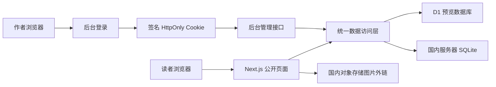

# 技术架构

## 技术选择

- Next.js App Router + React Server Components
- TypeScript 严格模式
- D1 / SQLite 双存储适配
- PBKDF2-SHA256 密码哈希
- HMAC-SHA256 会话签名
- 原生 CSS 响应式布局
- CodeMirror 6 后台编辑器
- react-markdown + remark-gfm + remark-breaks 统一渲染管线

## 数据安全

- 管理页面和每个写接口都在服务端校验会话。
- 写接口校验同源 `Origin`。
- Cookie 使用 `HttpOnly` 和 `SameSite=Lax`，HTTPS 环境启用 `Secure`。
- Markdown 原始 HTML 默认丢弃，前台正文不执行文章内 HTML。
- 链接只接受站内路径、页内锚点和 HTTPS 地址。
- 预览、前台和保存接口共用图片 HTTPS 与域名白名单。
- 保存接口通过 Markdown AST 提取普通图片与引用式图片，逐项验证地址。

## 存储模式

`STORAGE_DRIVER=sqlite` 使用服务器本地 SQLite，适合单机小型博客。省略该变量时使用绑定名为 `DB` 的 D1，适合 Sites 预览和托管版本。

## 十年数据策略

- 首页固定读取最近 10 篇。
- 随笔与教程每页 20 篇，归档每页 50 篇。
- 前台页码经过整数、下限和越界校验。
- 后台每次读取 30 条列表元数据，正文按文章 ID 单独加载。
- 后台深翻页使用 `updated_at + id` 游标，避免大偏移量查询。
- SQLite 使用 WAL，并为发布顺序、分类顺序和后台更新时间建立索引。
